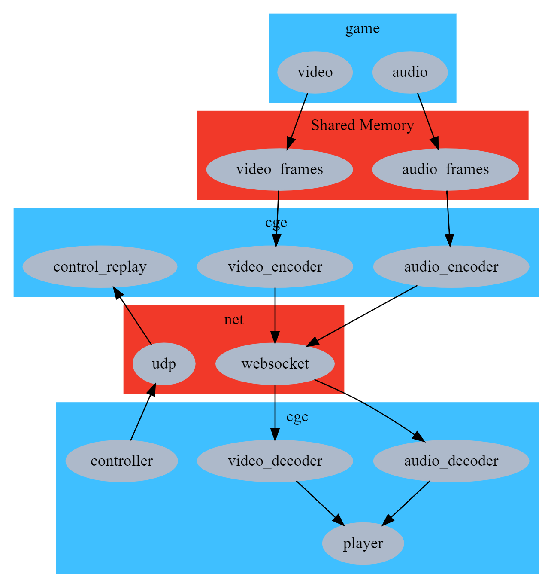
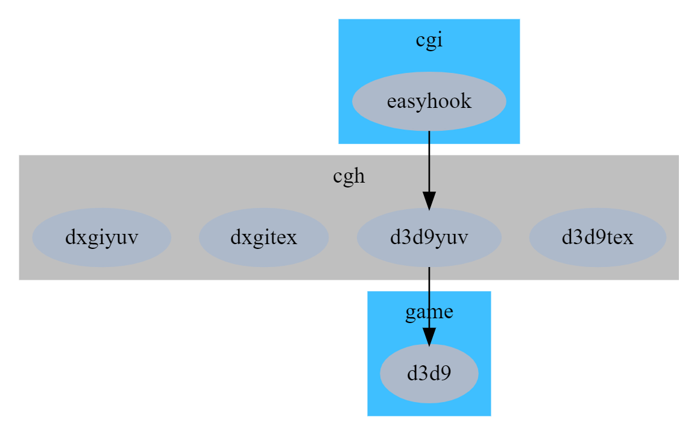
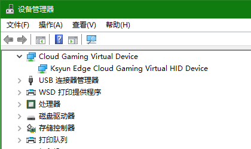

# 鎏光云游戏引擎

简体中文 | [English](README.md)

## 1. 配置要求

### 服务端

| 目标 | 最小化 | 建议 |
| --- | --- | --- |
| 操作系统 | Windows 7, 8, 8.1, 10 | Windows 10 |
| GPU | NVIDIA GPU | 已测试 RTX 1080Ti, GTX 2070S |
| 软件 | GeForce Experience | 最新的 GeForce Experience |
| 驱动 | GeForce Game Ready Driver | 最新的 GeForce Game Ready Driver |

* 如果您没有 NVIDIA GPU，可以使用 `--enable-nvenc=false` 参数启动 `cge`，将使用 CPU 编码。

### 客户端

| 目标 | 最小化 | 建议 |
| --- | --- | --- |
| 操作系统 | Windows 7, 8, 8.1, 10 | Windows 10 |
| CPU | 任意 | amd64 |

## 2. 基本信息

[](doc/cg.gv)

## 3. 快速体验

以下分模块介绍，所有模块都会开源。

### cge

全称为 `Cloud Gaming Engine`。

您可以直接运行 `cge`，此时应用的默认参数如下：

```
audio-bitrate: 128000
audio-codec: libopus
bind-address: ::
control-port: 8080
donot-present: false
enable-nvenc: true
keyboard-replay: none
gamepad-replay: none
stream-port: 8080
video-bitrate: 1000000
video-codec: h264
video-gop: 180
video-preset: llhp
video-quality: 23
```

可以运行 `cge --help` 查看所有参数：

```
Usage:
  -h [ --help ]                  produce help message
  --audio-bitrate arg (=128000)  set audio bitrate
  --audio-codec arg (=libopus)   set audio codec, can be one of {libopus, opus,
                                 aac}
  --bind-address arg (=::)       set bind address for listening, eg: 0.0.0.0
  --control-port arg (=8080)     set the UDP port for control flow
  --donot-present arg (=0)       Tell cgh don't present
  --enable-nvenc arg (=1)        Enable nvenc
  --keyboard-replay arg (=none)  keyboard replay method, can be one of {none,
                                 cgvhid}
  --gamepad-replay arg (=none)   gamepad replay method, can be one of {none,
                                 cgvhid, vigem}
  --stream-port arg (=8080)      set the websocket port for streaming, if port
                                 is 0, disable stream out via network. Capture
                                 and encode picture directly at startup but not
                                 on connection establishing, and never stop
                                 this until cge exit. stream port is not same
                                 as control port, this port is only for media
                                 output.
  --video-bitrate arg (=1000000) set video bitrate
  --video-codec arg (=h264)      set video codec, can be one of {h264, h265,
                                 hevc}, h265 == hevc
  --video-gop arg (=180)         set video gop
  --video-preset arg
  --video-quality arg (=23)      set video quality, lower is better, available
                                 range is 0-51, 0 is lossless
```

可以按 `Ctrl+C` 优雅退出。

### cgh

一些用于捕捉 D3D 游戏画面的 Hook DLL。

### cgi

一个命令行工具，用于把 Hook DLL 注入到游戏进程。

[](doc/cgi.gv)

```
Allowed options:
  -h [ --help ]              Produce help message
  -d [ --dynamic ] arg       Use dynamic injecting
  -e [ --exec ] arg          Path of the executable
  -a [ --arg ] arg           Arguments of the executable
  -c [ --cd ] arg            Current directory for the executable
  -i [ --imagename ] arg     Image name of the process being injected.
  -w [ --wait ] arg (=1,000) Wait before injecting. unit: ms
  --lx86 arg                 Path of x86 library path
  --lx64 arg                 Path of x64 library path
```

### cgvhid

全称为 Cloud gameing Virtual HID driver. 用于在服务端重放键盘灯外设消息。



### cgvidd

全称为 Cloud gameing Virtual Indirect Display Driver. 用于抓取服务器桌面。

### video_source

一个测试工具。直接跑就行，它会产生简单的图像，并把图像写入共享内存，然后通知 `cge` 来取。用 `cgc` 连接 `cge` 后就可以看到这些图像。

### cgc

和 `cge` 配套的客户端，目前是测试版，尚未开源。默认使用 [h264 版本](https://ks3-cn-beijing.ksyun.com/liuguang/cgc.7z)，如果您在服务端选择使用 h265，则应该使用 [h265 版本](https://ks3-cn-beijing.ksyun.com/liuguang/cgc-h265.7z)。

```
Usage:
  --server (=127.0.0.1) set server address
  --port (=8080)        set server port
  --hw_decode           hardware decoder, only support d3d11va now.
```

### cgs

WebRTC 服务端，配合 `cge` 使用，给 Web 客户端提供服务。

## 4. 搭建编译环境

### 4.1 VS2019

安装 VS2019，需要勾选 ATL 和 CLang。

独立安装 [CLang/LLVM x64](https://github.com/llvm/llvm-project/releases/download/llvmorg-11.0.0/LLVM-11.0.0-win64.exe)，因为 VS 带的 CLang 可能只有 x86 版本。

### 4.2 Boost

安装 [Boost](https://www.boost.org/)，设置 `BOOST_ROOT` 环境变量，值为您的安装目录。[详情](https://blog.umu618.com/2020/09/11/umutech-boost-1-installation/)

Boost 的编译命令，参考：

```
.\b2 --address-model=64 runtime-link=static
```

### 4.3 FFmpeg

把 [FFmpeg](https://www.ffmpeg.org/download.html) 的头文件放到 `deps\include`，把 libs 放到 `deps\lib`。

### 4.4 SDL

把 [SDL2](https://www.libsdl.org/) 的头文件放到 `deps\include`，把 libs 放到 `deps\lib`。

[SDL_ttf 2.0](https://www.libsdl.org/projects/SDL_ttf/) 和 [SDL_net 2.0](https://www.libsdl.org/projects/SDL_net/) 也同样操作。

### 4.5 WDK

编译 cgvhid, cgvidd 时需要的。

## 5. 编译和测试

用 VS 打开解决方案文件，按 F7 编译即可。

测试步骤：

- 服务器上运行 `cge`。

- 服务器上运行 `video_source`。

- 客户端上运行 `cgc --server=<server_address>`，请把 `<server_address>` 替换为服务器地址。

测试游戏：

假设您要测试 USF4。

- 服务器上安装 `cgvhid`。[详情](src/cgvhid/cgvhid/)

- 如果您更喜欢使用手柄而非键盘，请在服务器上安装 `ViGEmBus`。[下载](https://github.com/ViGEm/ViGEmBus/releases)

- 服务器上运行 `cge --keyboard-replay=cgvhid --gamepad-replay=vigem`。

- 服务器上运行 `cgi -d true -e SSFIV.exe -i SSFIV.exe --lx86 .\captureyuv.dll`，其中 `-e SSFIV.exe` 处要填好正确的路径名。

- 客户端上运行 `cgc --server=<server_address>`。

**注意** 目前只支持 D3D9、D3D11 游戏。（D3D10 游戏没测试过，但可能也支持。）

## 6. 联系方式

微信：UMUTech
