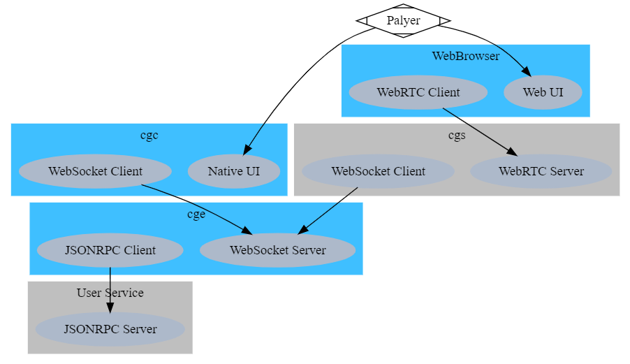
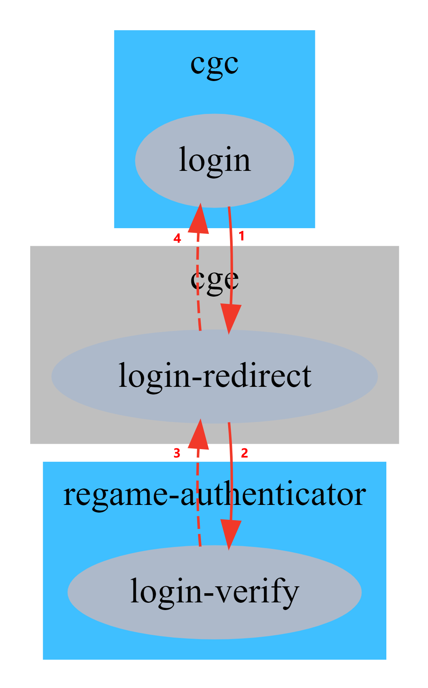
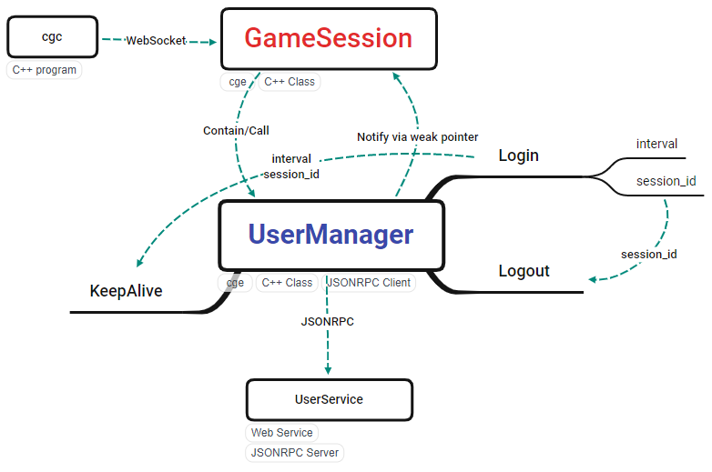
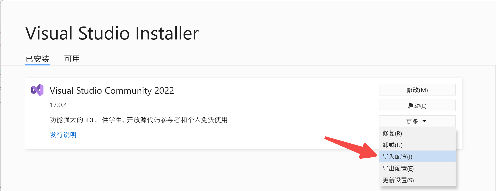

# 鎏光云游戏引擎

简体中文 | [English](README.md)

鎏光云游戏引擎是[金山云](https://www.ksyun.com/)边缘计算团队开发的一套服务于云游戏场景的技术集合。

云游戏引擎是一种将普通游戏云化的技术，分为服务端引擎和客户端引擎两部分，其中服务端最为复杂。鎏光还处于开发期，目前已经开源最为复杂的服务端引擎部分，客户端完善之后也将开源。

我们先起了中文名`鎏光`，再根据读音起英文名 `Regame`，然后发现它碰巧可以是 `remote game` 的缩写，实在是妙啊！

[按这里下载鎏光 v0.4](https://ks3-cn-beijing.ksyun.com/liuguang/regame_v0.4.zip)（此链接指向的资源会不定时更新！）

演示视频：

- 01-国产开源项目【鎏光云游戏引擎】试玩街霸

  - [哔哩哔哩](https://www.bilibili.com/video/bv1jt4y1r7GT), [西瓜视频](https://www.ixigua.com/6898563893564703239), [知乎](https://www.zhihu.com/zvideo/1314567244832530432)

- 09-鎏光 WebRTC 助力企业软件上云

  - [哔哩哔哩](https://www.bilibili.com/video/BV1g34y1U7RL), [西瓜视频](https://www.ixigua.com/7023285940831552031), [知乎](https://www.zhihu.com/zvideo/1436363494992445440)

## 1. 配置要求

### 服务端

| 目标 | 最小化 | 建议 |
| --- | --- | --- |
| 操作系统 | Windows 7 或以上 | Windows 10, 11 |
| GPU | NVIDIA GPU | 已测试 GTX 1080Ti, RTX 2070S |
| 软件 | GeForce Experience | 最新的 GeForce Experience |
| 驱动 | GeForce Game Ready Driver | 最新的 GeForce Game Ready Driver |

### 客户端

| 目标 | 最小化 | 建议 |
| --- | --- | --- |
| 操作系统 | Windows 7 或以上 | Windows 10, 11 |
| CPU | 任意 | amd64 |

## 2. 基本信息

- `cgh` 使用 Hook 技术捕获游戏画面，支持大多数 DirectX 游戏，比如赛博朋克 2077、街头霸王。

- `cge` 使用 FFmpeg 将采集到的声音和 `cgh` 捕获的游戏画面编码成多媒体流。

- `cgc` 使用 FFmpeg 解码音视频流，并用 SDL2 播放它们。

[](doc/regame-components.gv)

[](doc/cg.gv)

## 3. 快速体验

[FAQ](doc/faq.md)

### cge

全称为 `Cloud Gaming Engine`。

您可以直接运行 `cge`，使用默认参数。

可以运行 `cge --help` 查看所有参数：

```
KSYUN Edge Cloud Gaming Engine v0.4 Beta

Usage:
  -h [ --help ]                         Produce help message
  --audio-bitrate arg (=128000)         Set audio bitrate
  --audio-codec arg (=libopus)          Set audio codec. Select one of
                                        {libopus, aac, opus}
  --bind-address arg (=::)              Set bind address for listening. eg:
                                        0.0.0.0
  --disable-keys arg                    Disable virtual keys. eg: 164,165
                                        disable ALT; 91,92 disable WIN
  --donot-present arg (=0)              Tell cgh don't present
  --desktop-mode arg (=0)               Set desktop mode
  -g [ --global-mode ] arg (=0)         In global mode, will prefix object
                                        names with Global\.
  --gamepad-replay arg (=none)          Set gamepad replay method. Select one
                                        of {none, cgvhid, vigem}
  --hardware-encoder arg                Set video hardware encoder. Select one
                                        of {amf, nvenc, qsv}
  --keyboard-replay arg (=none)         Set keyboard replay method. Select one
                                        of {none, cgvhid, sendinput, message}
  --log-level arg (=info)               Set logging severity level. Select one
                                        of {trace, debug, info, warning, error,
                                        fatal}
  --mouse-replay arg (=none)            Set mouse replay method. Select one of
                                        {none, cgvhid, sendinput, message}
  -p [ --port ] arg (=8080)             Set the service port
  --user-service arg (=http://127.0.0.1:8545/)
                                        Set address for user service.
  --video-bitrate arg (=1000000)        Set video bitrate
  --video-codec arg (=h264)             Set video codec. Select one of {h264,
                                        h265, hevc}, h265 == hevc
  --video-gop arg (=180)                Set video gop. [1, 500]
  --video-preset arg                    Set preset for video encoder. For AMF,
                                        select one of {speed, balanced,
                                        quality}; For NVENC, select one of {p1,
                                        p2, p3, p4, p5, p6, p7, slow, medium,
                                        fast}; For QSV, select one of
                                        {veryfast, faster, fast, medium, slow,
                                        slower, veryslow}; otherwise, select
                                        one of {ultrafast, superfast, veryfast,
                                        faster, fast, medium, slow, slower,
                                        veryslow, placebo}
  --video-quality arg (=23)             Set video quality. [0, 51], lower is
                                        better, 0 is lossless.
```

可以按 `Ctrl+C` 优雅退出。

### regame-user-service

`cge` 使用 [regame-user-service](https://github.com/ksyun-kenc/regame-user-service) 来维护用户状态，比如验证登录。

[](doc/regame-authenticator.gv)



### regame-web-client

简单的[鎏光网页客户端](https://github.com/ksyun-kenc/regame-web-client)。您可以帮助我们完善它！

### cgh

一些用于捕捉 D3D 游戏画面的 Hook DLL。

### cgi

一个命令行工具，用于把 Hook DLL 注入到游戏进程。

[](doc/cgi.gv)

```
Allowed options:
  -h [ --help ]              Produce help message
  -d [ --dynamic ] arg       Use dynamic injecting
  -e [ --exec ] arg          Path of the executable
  -a [ --arg ] arg           Arguments of the executable
  -c [ --cd ] arg            Current directory for the executable
  -i [ --imagename ] arg     Image name of the process being injected.
  -w [ --wait ] arg (=1,000) Wait before injecting. unit: ms
  --lx86 arg                 Path of x86 library to inject into process
  --lx64 arg                 Path of x64 library to inject into process
```

### cgvhid

全称为 Cloud gaming Virtual HID driver. 用于在服务端重放键盘等外设消息。


### cgvd (仅限企业版)

全称为 Cloud gaming Virtual Display。它是一个用于抓取服务器桌面的 Indirect Display Driver。

### video_source

一个测试工具。直接跑就行，它会产生简单的图像，并把图像写入共享内存，然后通知 `cge` 来取。用 `cgc` 连接 `cge` 后就可以看到这些图像。

它也可以用来测试延迟。

参考视频：

- 05-国产开源项目【鎏光云游戏引擎】延迟测试

  - [哔哩哔哩](https://www.bilibili.com/video/BV1KU4y147ks/), [西瓜视频](https://www.ixigua.com/6918363287298146823) 

### cgc

和 `cge` 配套的简易客户端。

```
Ksyun Edge Cloud Gaming Client v0.3 Beta

Usage:
  -h [ --help ]                         Produce help message
  --audio-frame-delay arg (=2)          Set audio frame max delay, [0, 8]
  -f [ --fullscreen-state ] arg (=none) Set fullscreen state, can be one of
                                        {none, real, fake}
  -l [ --list-hardware-decoder ]        List hardware decoder
  -d [ --hardware-decoder ] arg         Set hardware decoder
  -r [ --remote-host ] arg (=127.0.0.1) Set remote host
  -p [ --remote-port ] arg (=8080)      Set remote port
  --top-most arg                        Keep the main window always on top
  -u [ --username ] arg                 Set username
  --verification-code arg               Set verification code
  --volume arg (=100)                   Set volume, [0, 100]
```

### cgs (仅限企业版)

WebRTC 服务端，配合 `cge` 使用，给 Web 客户端提供服务。

## 4. 搭建编译环境

### 4.1 Visual Studio

#### 4.1.1  VS2019

只有开发驱动时需要，因为目前 WDK 还不支持 VS2022。

#### 4.1.2 VS2022

[参考配置](doc/.vsconfig)



### 4.2 Boost

安装 [Boost](https://www.boost.org/)，设置 `BOOST_ROOT` 环境变量，值为您的安装目录。[详情](https://blog.umu618.com/2020/09/11/umutech-boost-1-installation/)

Boost 的编译命令，参考：

```
# For MTRelease configuration
.\b2 --address-model=64 runtime-link=static
```

参考视频：

- 06-鎏光云游戏引擎 FAQ：编译 Boost

  - [哔哩哔哩](https://www.bilibili.com/video/BV1P5411J7L8/), [西瓜视频](https://www.ixigua.com/6922104314932986376)

### 4.3 FFmpeg

设置 `FFMPEG_ROOT` 环境变量，值为您的 [FFmpeg](https://www.ffmpeg.org/download.html) 目录的全路径名。[建议采用 LGPL shared。](https://github.com/BtbN/FFmpeg-Builds/releases)

目录树应该类似这样：

```
├─bin
├─include
│  ├─libavcodec
│  ├─libavdevice
│  ├─libavfilter
│  ├─libavformat
│  ├─libavutil
│  ├─libpostproc
│  ├─libswresample
│  └─libswscale
└─lib
    ├─x64
    └─x86
```

参考视频：

- 04-鎏光云游戏引擎 FAQ：FFmpeg 配置

  - [哔哩哔哩](https://www.bilibili.com/video/BV1Dh41127xo/), [西瓜视频](https://www.ixigua.com/6917303228136849933)

### 4.4 SDL

设置 `SDL2_ROOT` 环境变量，值为您的 [SDL2](https://www.libsdl.org/) 目录的全路径名。

[SDL_ttf 2.0](https://www.libsdl.org/projects/SDL_ttf/) 也同样操作。

目录树应该类似这样：

```
├─bin
├─include
│  └─SDL2
└─lib
    ├─x64
    └─x86
```

### 4.5 WDK and VS2019

编译 cgvhid, cgvidd 时需要的。VS2022 暂时不能编译驱动。

### 4.6 额外工具

DbgView: 包含于 [Sysinternals Suite](https://www.microsoft.com/store/productId/9P7KNL5RWT25)

## 5. 编译和测试

```
git clone https://github.com/ksyun-kenc/liuguang
cd liuguang
git submodule update --init
```

用 VS 打开解决方案文件，最好选择 MTRelease 配置，再编译。

测试步骤：

- 服务器上运行 `cge`。

- 服务器上运行 `video_source`。

- 客户端上运行 `cgc -r <server_address>`，请把 `<server_address>` 替换为服务器地址。

测试游戏：

假设您要测试 USF4。

- 服务器上安装 `cgvhid`。[详情](src/cgvhid/cgvhid/)

- 如果您更喜欢使用手柄而非键盘，请在服务器上安装 `ViGEmBus`。[下载](https://github.com/ViGEm/ViGEmBus/releases)

- 服务器上运行 `cge --keyboard-replay=cgvhid --gamepad-replay=vigem`。

- 服务器上运行 `cgi -d true -e SSFIV.exe -i SSFIV.exe --lx86 .\captureyuv.dll`，其中 `-e SSFIV.exe` 处要填好正确的路径名。

- 客户端上运行 `cgc -r <server_address>`。

**注意** 目前只支持 D3D9、D3D11、D3D12 游戏。（D3D10 游戏没测试过，但可能也支持。）

参考视频：

- 02-国产开源项目【鎏光云游戏引擎】测试流程

  - [哔哩哔哩](https://www.bilibili.com/video/BV17T4y1N7bk/), [西瓜视频](https://www.ixigua.com/6909415761098310158), [知乎](https://www.zhihu.com/zvideo/1325164569828806656)

## 6. 联系方式

微信：wxid_8521565209912

- 请在好友请求里包含 regame、liuguang 或者鎏光。

- 如果您愿意告诉我们，您的公司名，沟通会更高效。

- 同样欢迎自由职业者和独立个人开发者。

## 7. 已知用户

<https://github.com/ksyun-kenc/liuguang/wiki/known-users>
