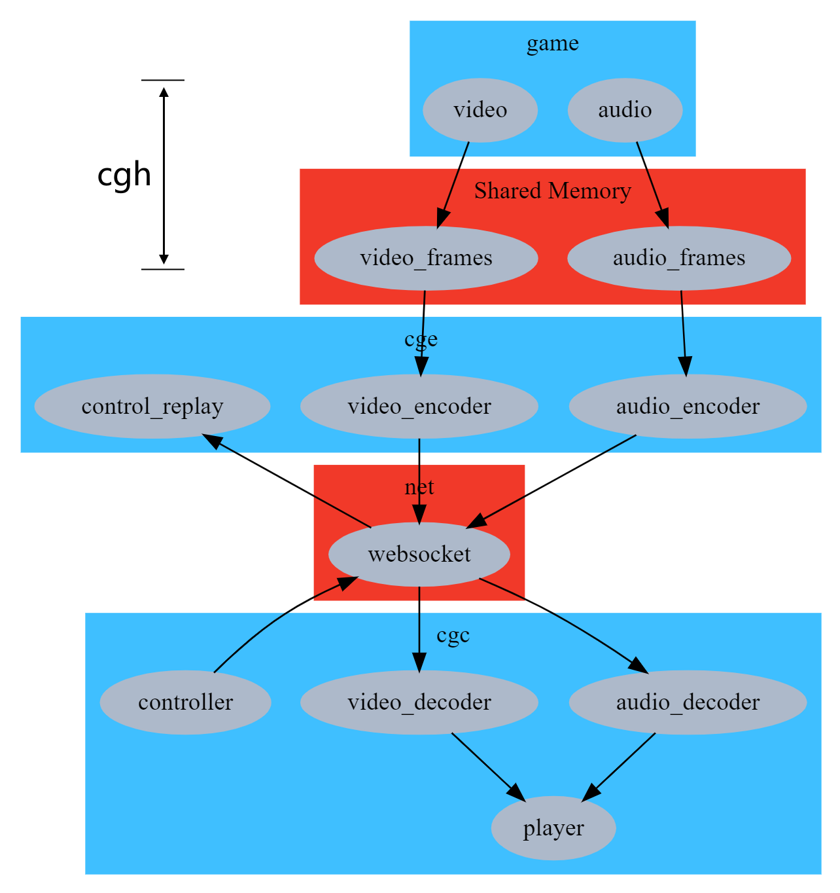

# FAQ

## 1. 用什么传输协议？



音视频之所以直接用基于 TCP 的 WebSocket 有三个原因：

- 鎏光社区版作为示范性项目，协议应该尽量简单。

- 云游戏对网络要求很高，在互联网上远程传输时天然就难以保证低延迟，所以我们设计时就是考虑用边缘网络为前提。在网络质量有一定保证时，TCP 是最容易实现的。

- 在使用 Boost 的前提下，不管是裸 TCP，还是 WebSocket，或者您可能使用的 KCP，想切换都是改几行代码的事情。现在之所以没用 KCP，是因为目前流行的类 Boost.Asio 的 KCP 库是 GPL 协议的，而我们的开源协议是 Apache。当然，您可以自己换，我们也建议您这么干。如果您愿意，也十分欢迎您能帮忙写个非 GPL 协议的类 Boost.Asio 的 KCP 库。

## 2. 构建脚本为什么用 bjam/b2，而不用 cmake？

即使用 cmake，也会有人问：为什么不用 [ninja](https://ninja-build.org/)？

事实上，构建脚本是个“能用就行”的中间部分，编译这个活儿真正关键的还是源代码和编译器。鎏光的代码中已经应用 Boost 库，这使得我们天然得到一个 bjam/b2 构建工具。这时候如果选择其它，比如 cmake、ninja，那还得再额外安装它。基于“简单性原则”——如无必要，勿增实体，我们选择就地使用 bjam/b2。

## 3. cgi 的 exec 参数不支持包含空格的路径？

当然支持！不过需要转义而已。参考：

```
# cmd
.\cgi.exe -d true -e "\"C:\\Program Files\\VideoLAN\\VLC\\vlc.exe\"" -i vlc.exe --lx64 .\captureyuv.dll

# Powershell
.\cgi.exe -d true -e '\"C:\\Program Files\\VideoLAN\\VLC\\vlc.exe\"' -i vlc.exe --lx64 .\captureyuv.dll

# Powershell
.\cgi.exe -d true -e "\""C:\\Program Files\\VideoLAN\\VLC\\vlc.exe\""" -i vlc.exe --lx64 .\captureyuv.dll
```

## 4. 默认密码 123456 是不是太弱了？

`cgc --username=UMU --verification-code=123456`

这个 verification-code 不是密码，而是手机验证码。当整个流程完善起来后，您可以用手机验证码登录，也可以用复杂密码登录，密码会用 SM3 Hash 后发送给 cge。
