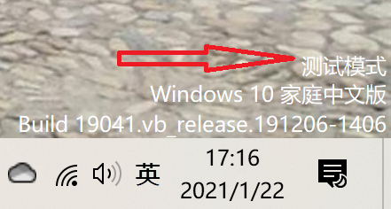
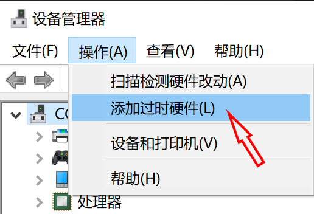

# Cgvhid

## Basic

Cloud Gaming Virtual Human Interface Device

## Building and Testing

- Install latest WDK.

- Open solution file with VS, and press F7.

- Enable Test Mode:

```
bcdedit.exe -set nointegritychecks on
bcdedit.exe -set loadoptions nointegritychecks
bcdedit.exe -set testsigning on
```

- Restart Windows.

You should see 'Test Mode' watermark at the bottom right corner of desktop.



- Install driver via `devmgmt.msc` or [cgvhid_setup](../cgvhid_setup).



- Run `cgvhid_test`.

## Note

`cgvhid` only works in Console Session. Do NOT test it in Remote Desktop.
